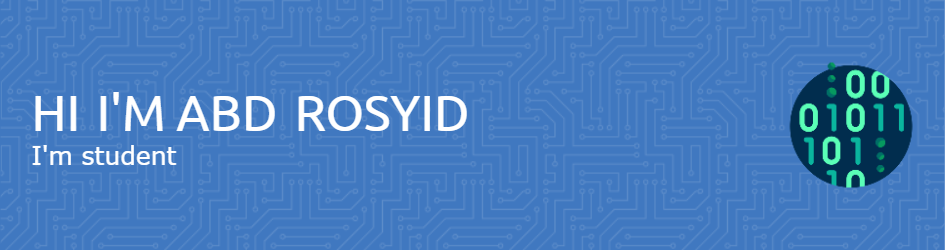

## Hello world! I'm ABD ROSYID

~ 📖 I'm learning Python
~ 📖 I'm learning PHP
~ 📖 I'm learning HTML
~ 📖 I'm learning CSS
~ 📖 I'm learning JS

#### **Learning**

#### **Connect with me**

#### **My Github Stats**

